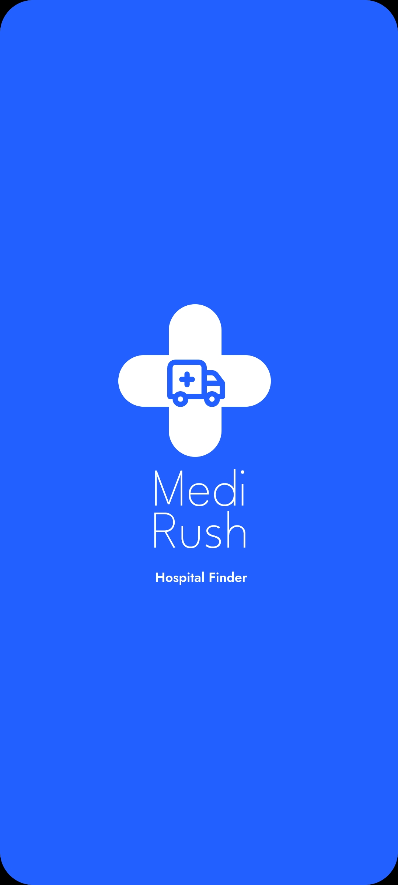
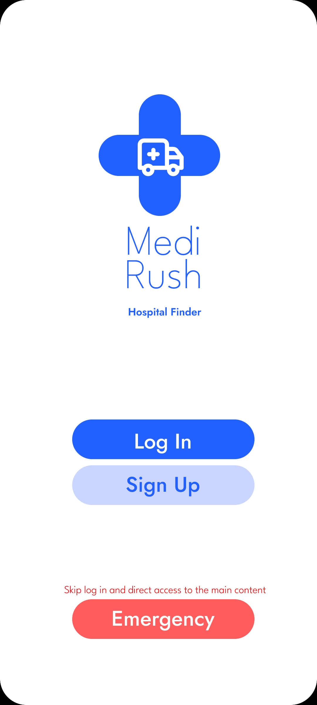
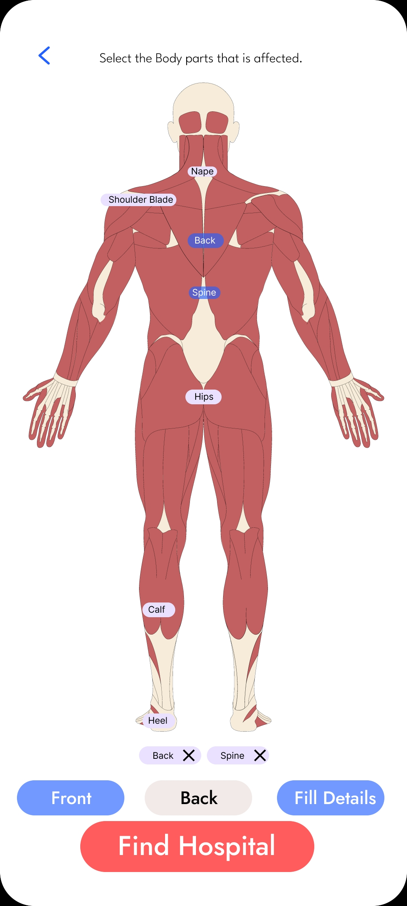
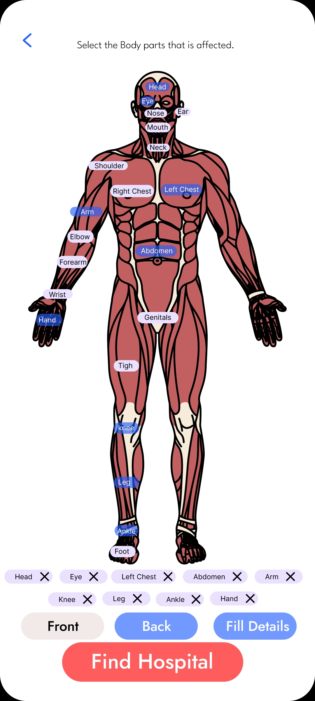
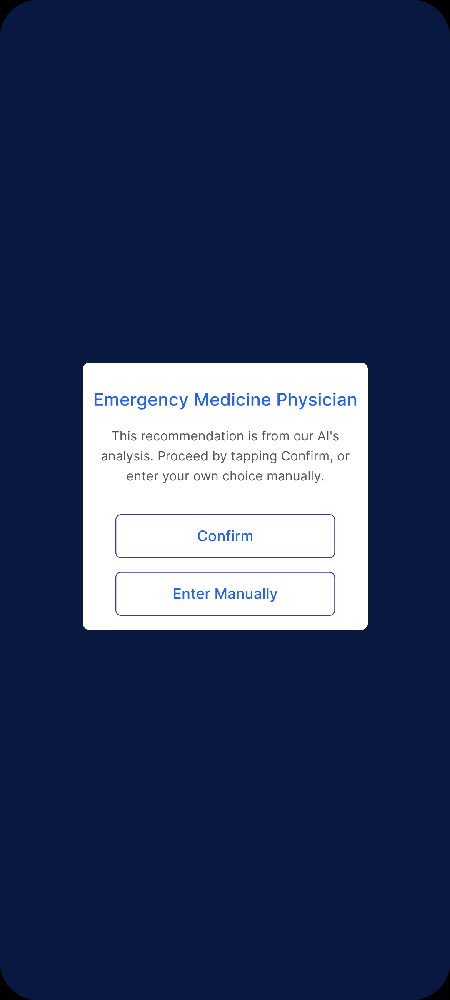
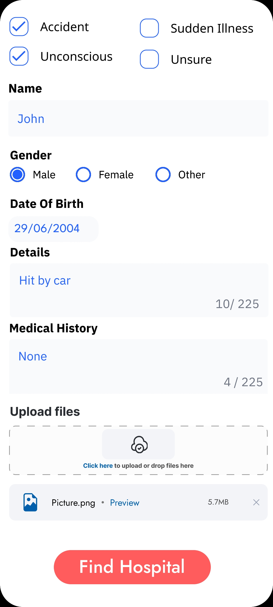
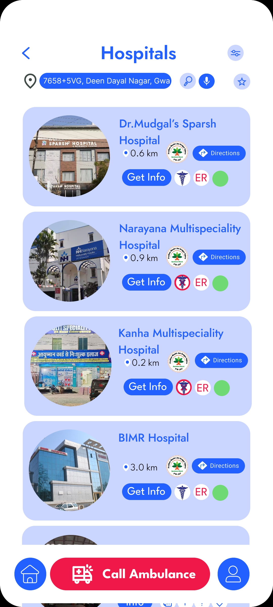
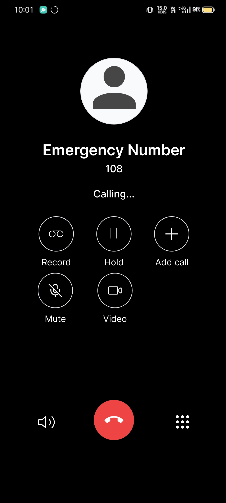
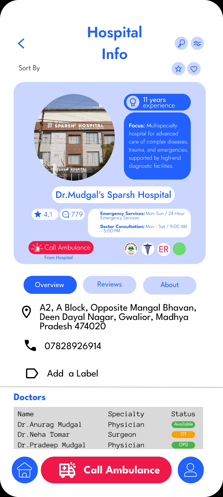
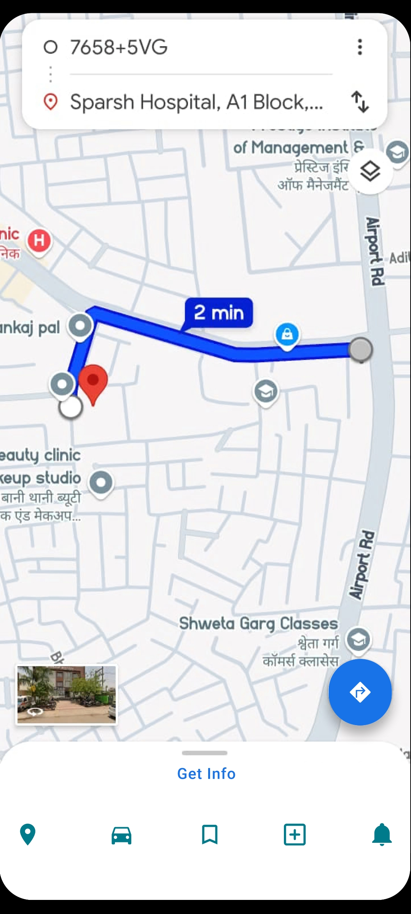

## 🎬 Demo Video (Private)

[Watch MediRush demo here](https://www.youtube.com/shorts/CnGUmduphRM)  
*(Accessible only to project visitors)*

# 🖼️ App Screenshots
See the app screens:
[Google Drive Screenshot Gallery](https://drive.google.com/drive/folders/1L6s8PJVoksT0E9oWF4NUkWPNrqdgY8NL?usp=sharing)

***
## 📱 App Screens & Workflow

Below are screenshot highlights showing the complete MediRush user journey, from launch to emergency response and navigation.

---

### 1. Splash Screen

  
Bright intro screen featuring the MediRush logo and hospital finder branding.

---

### 2. Login & Emergency Access

  
Main entry with options for logging in, signing up, or instant emergency access.

---

### 3. Body Selector (Back View)

  
Interactive back-view body diagram—users select affected body parts to find the right hospital.

---

### 4. Body Selector (Front View)

  
Interactive front-view body diagram for detailed symptom input and hospital matching.

---

### 5. Analysis Progress

  
Displays a real-time progress message as the AI processes user data.

---

### 6. Specialty Recommendation

  
Shows an AI-driven recommendation for the most appropriate medical specialist, with options to confirm or choose manually.

---

### 7. Emergency Patient Details

  
Allows users to input key emergency details, patient info, medical history, and upload files for faster triage.

---

### 8. Hospital Listing

  
Presents nearby hospitals with distance, details, and an option for instant ambulance calling.

---

### 9. Emergency Call Screen

  
Displays the in-progress call to the national emergency number (108) for immediate assistance.

---

### 10. Hospital Info

  
Shows detailed information for a selected hospital, including specialties, contact details, doctor availability, and ambulance call option.

---

### 11. Directions Screen

  
Provides turn-by-turn navigation to the selected hospital using a live map view.

***

# 🚑 MediRush: Automated Medical Emergency Response App

MediRush is an Android application that streamlines emergency response, matching patients with the right hospital and specialist in real time, displaying doctor and equipment availability, and enabling ambulance coordination for rapid, transparent care.  
[1][2][3]

***

## 📝 Overview

MediRush helps users take decisive action during a medical emergency:

- 🌟 **Animated, intuitive UI:** Instantly input symptoms or select emergency types via a modern Compose interface.
- 🧑‍⚕️ **Rule-based triage:** Patient input is matched with the correct medical specialty (e.g., cardiology, trauma, pulmonology).
- 🏥 **Live hospital and equipment data:** Only hospitals with the correct specialist and necessary resources are recommended.
- 🟢🟡🔴 **Real-time doctor status:** Automated attendance system updates availability status (green = available, yellow = busy, red = unavailable).
- 💳 **Ayushman card support:** Hospitals supporting government schemes are marked for transparency and accessible care.
- 🚨 **Direct ambulance/call integration:** Instantly call the selected hospital’s ambulance or emergency number, and specify your destination hospital.
- 📍 **GPS-powered navigation:** Quickly get directions to the recommended facility.
- 🔐 **Secure authentication:** Every session is protected via Firebase Auth.

***

## ✨ Features

- 🚑 Input symptoms and emergencies with rapid, interactive UI.
- 🩺 Accurate triage and specialty mapping for every situation.
- 🏥 Filtered hospital listing by specialty, doctor, equipment, and scheme support.
- 🟢 Doctor status clearly shown for faster decisions.
- 📞 One-tap ambulance calling and emergency service integration.
- 🗺️ Live directions from your location to the selected hospital.
- 🔒 Safe and secure user accounts and health information.

***

## 🛠️ Technology Stack

| Component              | Technology                    |
|------------------------|------------------------------|
| 💻 Language            | Kotlin                       |
| 🎨 UI                  | Jetpack Compose              |
| 🖼️ Images/Animation    | Coil Compose                 |
| 🔐 Authentication      | Firebase Auth                |
| ☁️ Backend/Realtime    | Firebase, Supabase           |
| 🌐 Networking          | Ktor Client                  |
| 🗃️ Data Serialization  | Kotlinx Serialization JSON   |
| 🧭 Navigation          | AndroidX Navigation Compose  |
| 📍 Location            | Google Play Services         |
| ⚙️ Permissions         | Accompanist Permissions      |

***

## ⚡ Workflow Example

1. 📝 User enters symptoms or selects the emergency.
2. 🩺 MediRush matches input to a specialty and queries live hospital and doctor status.
3. 🏥 User sees available hospitals by proximity, resources, and scheme support.
4. 📞 User selects a hospital and directly calls the ambulance or emergency number, specifying their choice.
5. 🗺️ Turn-by-turn directions are provided to speed up response and access to care.

***
